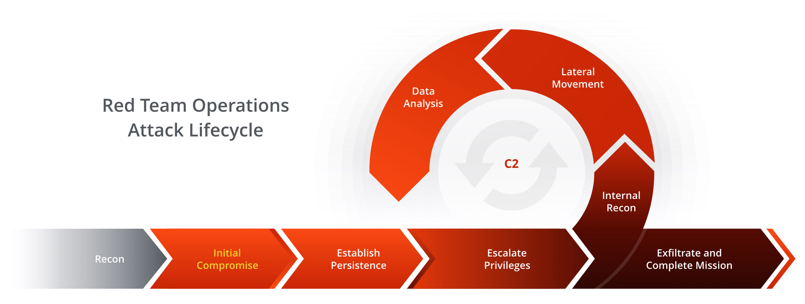

# redteam-roadmap
Guide opérationnel  pour missions red-team : checklists

| Technique | Outil 1 | Outil 2 |
|-----------|---------|---------|
| BloodHound | BloodHound | SharpHound |
| NTLM sniff | CrackMapExec | ldapdomaindump |
